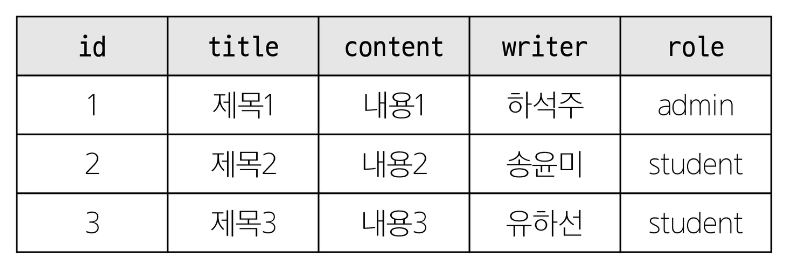

# SQL Advanced

- JOIN

    - JOIN clause
    - INNER JOIN / LEFT JOIN/ RIGHT JOIN / SELF JOIN

- Subquery

    - Single-row Subquery / Multi-row Subquery / Multi-column Subquery

- Database Index

    - INDEX / Index 종류
    - Index 생성/추가하기 / Index 사용하기 / Index 삭제하기

- 참고

    - VIEW / B-tree


## JOIN

- 관계 : **여러** 테이블 간의 (논리적) 연결

- 관계의 필요성
    - 커뮤니티 게시판에 필요한 데이터 생각해보기

    

    - '하석주'가 작성한 모든 게시글을 조회하기
    - 어떤 문제점이 있을까?
        - 동명이인이 있다면 혹은 특정 데이터가 수정된다면?
            ```SQL
            SELECT * FROM 테이블 WHERE writer = '하석주';
            ```
    
    - 테이블을 나누어서 분류하자

        - 각 게시글은 누가 작성했는지 알 수 있을까?
        - 작성자들의 역할은 무엇일까?

    
    - articles와 users 테이블에 각각 userId, roleId 외래 키 필드 작성

        - 관리자인 사람만 보고 싶다면? → roleId가 1인 데이터 조회
        - 하석주라는 사람이 권미숙으로 개명한다면? → users에서 한번만 변경하면 자동으로 모두 변경


- JOIN이 필요한 순간
    - 테이블을 분리하면 데이터 관리는 용이해질 수 있으나 출력시에는 문제가 있음
    - 테이블 한 개 만을 출력할 수 밖에 없어 다른 테이블과 결합하여 출력하는 것이 필요해짐
    - 이때 사용하는 것이 'JOIN'


### JOIN clause
- **JOIN** clause : 둘 이상의 테이블에서 데이터를 검색하는 방법

- JOIN 종류
    1. INNER JOIN
    2. LEFT JOIN
    3. RIGHT JOIN
    4. SELF JOIN

- 사전 준비
    - users 테이블 생성
        ```SQL
        CREATE TABLE users(
            id INTEGER PRIMARY KEY AUTO_INCREMENT,
            name VARCHAR(50) NOT NULL,
            age INTEGER,
            parent_id INTEGER,
            FOREIGN KEY (parent_id) REFERENCES users(id)
        );
        ```
    
    - 각 테이블에 실습 데이터 입력
        ```SQL
        INSERT INTO
            users (name, age, parent_id)
        VALUES
            ('하석주', 50, NULL),
            ('정윤미', 48, NULL),
            ('유하선', 46, NULL),
            ('하민성', 24, 1),
            ('정아인', 22, 2),
            ('송민', 19, 1),
            ('정지민', 22, 2);
        ```

    - articles 테이블 생성
        ```SQL
        CREATE TABLE articles (
            id INTEGER PRIMARY KEY AUTO_INCREMENT,
            title VARCHAR(50) NOT NULL,
            content VARCHAR(100) NOT NULL,
            userId INTEGER,
            FOREIGN KEY (userId) REFERENCES users(id)
        );
        ```

    - 각 테이블에 실습 데이터 입력
        ```SQL
        INSERT INTO
            articles (title, content, userId)
        VALUES
            ('제목1', '내용1', 1),
            ('제목2', '내용2', 2),
            ('제목3', '내용3', NULL),
            ('제목4', '내용4', 3),
            ('제목5', '내용5', 1),
            ('제목6', '내용6', NULL),
            ('제목7', '내용7', 5);
        ```


## INNER JOIN
- **INNER JOIN** clause : 두 테이블에서 값이 일치하는 레코드에 대해서만 결과를 반환


- INNER JOIN syntax
    ```SQL
    SELECT
        select_list
    FROM
        table_a
    INNER JOIN table_b
        ON table_b.fk = table_a.pk;
    ```
    - FROM 절 이후 메인 테이블 지정(table_a)
    - INNER JOIN 절 이후 메인 테이블과 조인할 테이블을 지정(table_b)
    - ON 키워드 이후 조인 조건을 작성
    - 조인 조건은 table_a와 table_b 간의 레코드를 일치시키는 규칙을 지정


- INNER JOIN 예시

    - 작성자가 있는 (존재하는 회원) 모든 게시글을 작성자 정보와 함께 조회


        ```SQL
        SELECT articles.*, users.id, users.name FROM articles
        INNER JOIN users
            ON users.id = articles.userId;
        ```


- INNER JOIN 활용
    - 1번 회원(하석주)이 작성한 모든 게시글의 제목과 작성자명을 조회

        ```SQL
        SELECT articles.title, users.name
        FROM articles
        INNER JOIN users
            ON users.id = articles.userId
        WHERE users.id = 1;
        ```


### LEFT JOIN
- **LEFT JOIN** clause : 오른쪽 테이블의 일치하는 레코드와 함께 왼쪽 테이블의 모든 레코드 반환


- LEFT JOIN syntax
    ```SQL
    SELECT
        select_list
    FROM
        table_a
    LEFT JOIN table_b
        ON table_a.fk = table_a.pk;
    ```
    - FROM 절 이후 왼쪽 테이블 지정(table_a)
    - LEFT JOIN 절 이후 오른쪽 테이블 지정(table_b)
    - ON 키워드 이후 조인 조건을 작성
        - 왼쪽 테이블의 각 레코드를 오른쪽 테이블의 모든 레코드와 일치시킴


- LEFT JOIN 예시

    - 모든 게시글을 작성자 정보와 함께 조회


        ```SQL
        SELECT articles.*, users.id, users.name FROM articles
        LEFT JOIN users
            ON users.id = articles.userId;
        ```

- LEFT JOIN 특징
    - 왼쪽 테이블의 모든 레코드를 표기
    - 오른쪽 테이블과 매칭되는 레코드가 없으면 NULL을 표시


- LEFT JOIN 활용
    - 게시글을 작성한 이력이 없는 회원 정보 조회

        ```SQL
        SELECT articles.name
        FROM users
        LEFT JOIN articles
            ON articles.userId = users.id
        WHERE articles.userId IS NULL;
        ```


### RIGHT JOIN
- RIGHT JOIN syntax
    ```SQL
    SELECT
        select_list
    FROM
        table_a
    RIGHT JOIN table_b
        ON table_b.fk = table_a.pk;
    ```
    - FROM 절 이후 왼쪽 테이블 지정(table_a)
    - RIGHT JOIN 절 이후 오른쪽 테이블 지정(table_b)
    - ON 키워드 이후 조인 조건을 작성
        - 오른쪽 테이블의 각 레코드를 왼쪽 테이블의 모든 레코드와 일치시킴


- RIGHT JOIN 예시

    - 모든 사용자가 작성한 글을 조회

        ```SQL
        SELECT articles.*, users.id, users.name FROM articles
        RIGHT JOIN users
            ON users.id = articles.userId;
        ```


### SELF JOIN
- **SELF JOIN** clause
    - 동일한 테이블의 칼럼을 비교하여 일치하는 데이터를 추가로 붙여 반환
    - 주로 계층적 데이터 구조를 표현하거나 동일 테이블 내에서 특정 관계를 찾을 때 사용


- SELF JOIN syntax
    ```SQL
    SELECT
        select_list
    FROM
        table_a
    [INNER] JOIN table_a t_a
        ON table_a.column = ta.column;
    ```
    - FROM 절 이후 본 테이블 지정(table_a)
    - JOIN 절 이후 본 테이블 지정(table_a)
        - 이 때 반드시 별칭 설정
    - ON 키워드 이후 조인 조건을 작성
        - 본 테이블의 칼럼과 별칭 테이블의 칼럼을 이용하여 비교


- SELF JOIN 예시

    - users 테이블의 부모 자식 관계 조회


        ```SQL
        SELECT
            parent.id AS p_id,
            parent.name AS parent,
            child.id AS c_id,
            child.name AS child
        FROM
            users parent
        INNER JOIN
            users child ON parent.id = child.parent_id;
        ```


- SELF JOIN 활용
    - 서로의 형제자매가 누구인지 id와 이름 조회

        ```SQL
        SELECT
            users.id AS user_id,
            users.name AS user_name,
            sibling.id AS sibling_id,
            sibling.name AS sibling_name
        FROM
            users
        JOIN
            users sibling ON users.parent_id = sibling.parent_id
        WHERE
            users.id != sibling.id;
        ```


## Subquery
- 서브 쿼리란?
    - 하나의 SQL 문 안에 포함되어 있는 또 다른 SQL 문
    - 복잡한 데이터를 이용하여 검색하거나 값을 비교할 때 사용


- Subquery 사용 방법
    - 서브 쿼리는 괄호를 감싸서 사용
    - 서브쿼리 사용이 가능한 곳
        - SELECT 절
            - 일반적으로 계산된 값을 하나 이상의 칼럼으로 반환해야 할 때 사용
        - FROM 절
            - 중간 집계나 계산, 결과 재사용, 조인 조건 단순화 할 때 사용
        - WHERE 절
            - 특정 조건을 만족하는 데이터를 필터링하거나 검색할 때 사용
        - 그 외 HAVING 절, INSER 문의 VALUES 절, UPDATE 문의 SET 절에서 사용 가능


- Subquery 종류
    - 단일 행 서브쿼리(Single-row Subquery)
    - 다중 행 서브쿼리(Multi-row Subquery)
    - 다중 열 서브쿼리(Multi-column Subquery)


### Single-row Subquery
- 단일 행 서브쿼리
    - 실행 결과가 항상 1건 이하인 서브쿼리
    - 비교 연산자 (=, <, >, <= ,>=, <>)와 함께 사용


- Single-row Subquery 활용
    - 'North America' 대륙의 평균 인구보다 인구가 많은 국가의 이름과 인구 조회

        ```SQL
        SELECT
            Name, Population
        FROM
            country
        WHERE
            Population > (
                SELECT AVG(Population)
                FROM country
                WHERE Continent = 'North America'
            );
        ```

    
    - country 테이블의 'Benin'이라는 국가의 국가 코드를 이용하여, city 테이블에 등록된 'Benin'의 모든 도시 정보를 조회

        ```SQL
        SELECT
            *
        FROM
            country
        WHERE
            CountryCode = (
                SELECT Code
                FROM country
                WHERE Name = 'Benin'
            );
        ```

    - country 테이블의 각 국가마다 해당 국가 소속의 평균 도시 인구를 city 테이블을 이용하여 조회

        ```SQL
        SELECT
            Name AS CountryName,
            (
                SELECT AVG(Population)
                FROM city
                WHERE CountryCode = Code
            )   AS AvgCityPopulation
        FROM country;
        ```

        ```SQL
        SELECT
            country.Name AS CountryName,
            (
                SELECT AVG(city.Population)
                FROM city
                WHERE city.CountryCode = country.Code
            )   AS AvgCityPopulation
        FROM country;
        ```
        - 어떤 테이블의 칼럼을 사용하는지 테이블 명을 붙여주는 것이 가독성이 좋음


- 단일 행 서브쿼리 정리
    - 단일 행 서브쿼리는 항상 단일 값을 반환
        - WHERE 절이나 SELECT 절에 사용하는 것이 일반적
    - 비교 연산자 (=, <=, >=, <, >)
        - 비교 대상인 서브 쿼리의 값이 여러 개가 나올 시 에러 발생


### Multi-row Subquery
- 다중 행 서브쿼리
    - 실행 결과가 여러 개의 결과 행을 반환할 수 있는 서브쿼리
    - IN, ANY, ALL 연산자와 함께 사용


- Multi-row Subquery 활용
    - Asia에 속하는 모든 도시를 조회

        ```SQL
        SELECT *
        FROM city
        WHERE
            CountryCode IN (
            -- CountryCode = () : 비교 연산자를 사용하면 에러 발생    
                SELECT Code
                FROM country
                WHERE Continent = 'Asia'
            );
        ```

    - 인구가 10,000,000명 이상인 국가들의 국가 코드, 도시 이름, 지구, 인구를 조회

        ```SQL
        SELECT co.Code, c.Name, c.District, c.Population
        FROM
            city c
            JOIN (SELECT Code
                  FROM country
                  WHERE Population >= 10000000) co
        ON c.CountryCode = co.Code;
        ```


- 다중 행 서브쿼리 정리
    - 다중 행 서브쿼리는 2개 이상의 값을 반환
        - 단순 비교 연산자를 사용할 수 없음
    - IN, ANY, ALL 연산자와 함께 사용
        - WHERE 과 HAVING 절에서 주로 사용됨


### Multi-column Subquery
- 다중 칼럼 서브쿼리
    - 실행 결과가 하나 이상의 칼럼을 반환하는 서브쿼리
    - 주로 비교 연산자나 EXISTS, IN 연산자와 함께 사용


- Multi-column Subquery 활용
    - 각 대륙별 독립 연도가 최근인 국가의 이름, 대륙, 독립 연도를 조회

        ```SQL
        SELECT
            Name, Continent, IndepYear
        FROM country
        WHERE (Continent, IndepYear) IN (
            SELECT Continent, MAX(IndepYear)
            FROM country
            GROUP BY Continent
        );
        ```


- 다중 칼럼 서브쿼리 정리
    - 다중 칼럼 서브쿼리의 결과로 여러 개의 칼럼이 반환
        - 주로 메인 쿼리의 조건과 동시에 비교됨


## Database Index

### INDEX
- Index란?
    - 데이터베이스에서 데이터를 보다 빠르게 찾기 위해 사용되는 자료구조
    - 책에서 원하는 부분을 처음부터 찾는 것이 아닌 목차를 보고 빠르게 찾을 수 있는 방식과 유사


- Index 사용의 장점
    - 조회하는 속도가 빠름
    - 시스템의 부하가 적음


- Index 사용의 단점
    - 인덱스 정보를 추가로 저장하기 위한 저장 공간이 필요
    - 삽입, 수정, 삭제가 빈번한 테이블인 경우 성능이 오히려 떨어짐


### Index 종류
- Index 종류
    - 기본 인덱스
    - 유니크 인덱스


- 기본 인덱스
    - 일반적으로 선언했을 때의 인덱스
    - 인덱스로 설정된 칼럼의 데이터에 NULL 값이 존재할 수 있음
    - 인덱스가 설정된 칼럼의 데이터에 중복이 있을 수 있음
    - Ex. city 테이블의 CountryCode 칼럼을 Index로 설정했을 때 'KOR' 데이터가 중복될 수 있음


- 유니크 인덱스
    - UNIQUE 키워드와 함께 선언했을 때의 인덱스
    - 인덱스를 설정할 칼럼의 데이터들은 각각 고유한 값이어야 함
        - 중복된 데이터가 존재할 시 'Duplicate entry' 에러 발생
        - 칼럼을 추가로 구성하여 고유한 값으로 구성하면 해결


### Index 생성/추가하기
- Index 생성하기
    ```SQL
    CREATE TABLE table_name (
        column1 INT PRIMARY KEY AUTO_INCREMENT,
        column2 VARCHAR(150) DEFAULT NULL,
        column3 VARCHAR(30),
        -- INDEX 생성하기 1 (INDEX 키워드 사용)
        INDEX index_name (column2),
        -- INDEX 생성하기 2 (KEY 키워드 상ㅇ)
        KEY index_name2 (column3)
    );
    ```
    - 어떤 칼럼을 인덱스로 설정하는 것이 좋을까?
        - 자주 검색되는 칼럼
        - 중복되는데이터가 적은 칼럼


- Index 추가하기 1
    ```SQL
    CREATE INDEX index_name
    ON table_name (column1, column2, ...);
    ```
    - CREATE INDEX 구문을 이용해서 추가하는 방법


- Index 추가하기 2
    ```SQL
    ALTER TABLE table_name
    ADD INDEX index_name (column1, column2, ...);
    ```
    - ALTER TABLE 구문을 이용해서 추가하는 방법


- INDEX 생성과 INDEX 추가의 차이점?
    - 둘 다 Index를 설정하는 것은 동일
    - 테이블 생성 시 인덱스를 정의하는 것이 좀 더 효율적(데이터가 없기 때문에 Index를 설정하는 시간이 적음)
    - 이미 테이블에 많은 데이터가 존재하는 상태에서 Index를 추가 한다면 추가된 Index 설정을 위해 일시적으로 데이터베이스 시스템에 영향이 있을 수 있음


### Index 사용하기
- Index 사용하기
    - 이미 생성된 city 테이블에는 Name 칼럼과 CountryCode 칼럼이 인덱스로 설정되어 있음
        ```SQL
        SHOW CREATE TABLE city;

        -- CREATE TABLE 'city' (
        -- 'ID' int NOT NULL AUTO_INCREMENT,
        -- 중략...
        -- PRIMARY KEY ('ID'),
        
        -- KEY 'CountryCode' ('CountryCode'),
        -- KEY 'idx_city_name' ('Name'),
        
        -- CONSTRAINT 'city_ibfk_1' FOREIGN KEY ('CountryCode')   )
        ```


### Index 삭제하기
    - INDEX / Index 종류
    - Index 생성/추가하기 / Index 사용하기 / Index 삭제하기


## 참고
