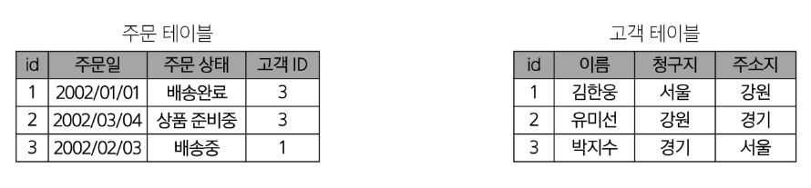
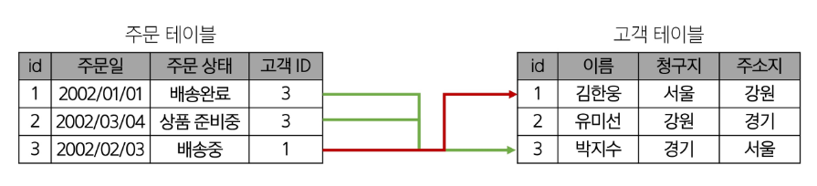

# Database

- Database

    - 개요
    - Relation Database
    - RDBMS

- Database Modeling

    - Proceeding with Database modeling

- Database Normalization

    - 1NF ~ 3NF, BCNF

- SQL 기본 
    - SQL Statements

- DDL
    - CREATE TABLE
    - ALTER TABLE
    - DROP TABLE
    - TRUNCATE TABLE

- 참고

---
### `DataBase`

#### 개요

- 데이터베이스 : 체계적인 데이터 모음

- 데이터 : 저장이나 처리에 효율적인 형태로 변환된 정보

- 증가하는 데이터 사용량

    - 배달의 민족 국내 주문 건수 6억 8천만 건(2020)

    - 구독자 2억 3840만명이 1000억 시간 넷플릭스 시청(2023 1~6월)

    - 전세계 모든 데이터의 약 90%는 2015년 이후 생산된 것(IBM)

- 데이터 센터의 성장

    - 네이버 - 제2데이터센터에 6500억 투자(2020)

    - 카카오 - 제1데이터센터와 제2데이터센터에 1.5조 투자(2022)

    - 전세계 데이터 센터 시장 2022년부터 2026년까지 연평균 20% 이상 성장 예상

- **데이터를 저장하고 잘 관리하여 활용할 수 있는 기술이 중요해짐**

    - 우리가 알고 있는 데이터 저장 방식은 어떤 것이 있을까?

---
### `Relation Database`

- 데이터베이스 역할 : 데이터를 **저장**하고 조작

- 관계형 데이터베이스 : 데이터 간의 **관계**가 있는 데이터 항목들의 모음

    - 테이블, 행, 열의 정보를 구조화하는 방식

    - 서로 관련된 데이터 포인터를 저장하고 이에 대한 엑세스를 제공

    
    

- 관계 : 여러 테이블 간의 (논리적) 연결

- 관계로 할 수 있는 것

    - 이 관계로 인해 두 테이블을 사용하여 데이터를 다양한 형식으로 조회할 수 있음

        - 특정 날짜에 구매한 모든 고객 조회
        
        - 지난 달에 배송일이 지연된 고객 조회 등

## RDBMS

# Database Modeling
## Proceeding with Database modeling

# Datbase Normalization
## 1NF ~ 3NF, BCNF

# SQL 기본
## SQL Statements

# DDL
## CREATE TABLE

## ALTER TABLE

## DROP TABLE

## TRUNCATE TABLE

# 참고